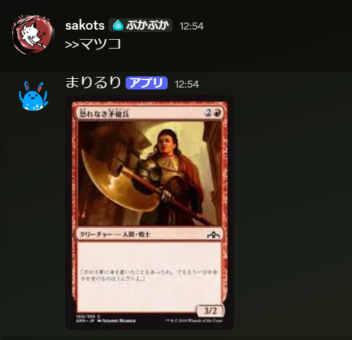
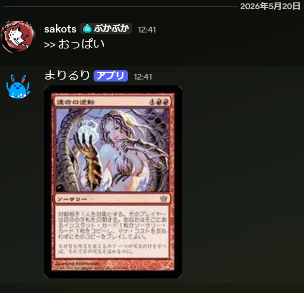

# mtg_img_searcher

MTG Image searcher

## 何？

入力された文字列にmtgとかカードとかを加えて画像検索して1件返すだけのDiscordBot。


yahoo検索バージョンではおっぱいチャレンジ成功


## 使い方

1. `uv add discord.py bs4 urllib3 python-dotenv requests`
2. `.env`ファイルを作成し、`TOKEN=(ここにDiscordのBotトークンを入れる)`のように作成してください
3. Discord Developer Portal の Bot 設定で `MESSAGE CONTENT INTENT` をONにしてください。

起動:

bing版

```bash
uv run python main.py
```

yahoo検索版

```bash
uv run python yahoo.py
```

好みで使ってください。

## こうしんりれき

### 2026/05/20

- 縦横比の厳密化
- yahoo版追加（おっぱいチャレンジに成功）

### 2026/05/18 v3.0.0

- bing検索にした
  - 旧バージョン（`mtg_img_searcher.py`、`mtg_img_searcher2.py`）は動かないです

### 2022/12/23

- エラーを出なくした。画像はダウンロードできない。検索の仕様変わった？

### 2022/12/22 v2.0.0

- ~~画像検索サイトをgatherer.wizards.comとmtg-jp.comにした。~~ 画像サイズ最適化によりおっぱい最適化復活。

### 2019/09/22

- 画像を1件だけダウンロードするように無理やりした。

### 2019/09/11

- google検索を使ったver2公開。こちらは一度画像をダウンロードします。

### 2019/09/10 2度め

- 画像ファイルをpng限定にすることによりカード以外が出る可能性をさらに下げた。

### 2019/09/10

- mtgカードギャラリーの画像サイズが1パターンではないことが判明したため修正。おっぱい最適化を断念。

### 2019/09/06

- とりあえず公開
